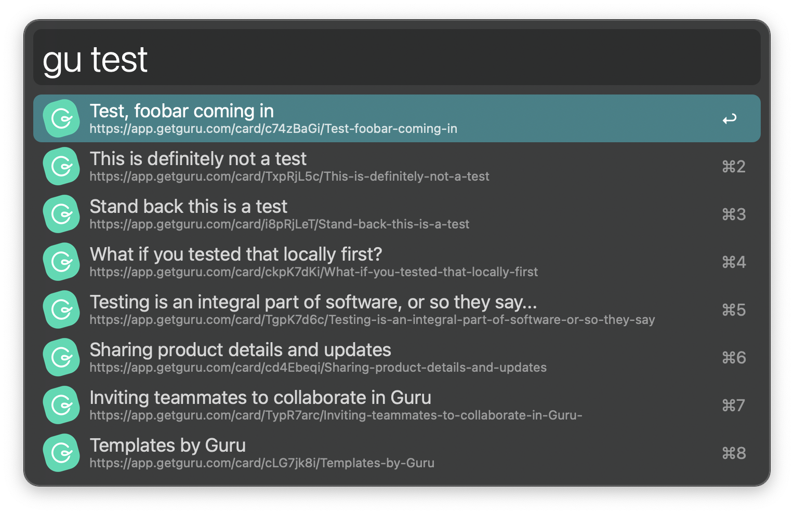

# Guru Workflow for Alfred 3/4

This workflow gives you in-line access to Guru, helping you access your organisation's knowledge in a jiff.

To get started you first have to:

1. Set your email, which you can do by running `gu > set email <your email>`
2. Set password or token, which you can do by running `gu > set password <your password>` or `gu > set token <your token>`

After this you can simply type `gu <some word>` in Alfred, and there you go.

**Note:** Tokens are prioritised over passwords so if you have set a password *and* a token then the token will be used for authentication.

## Installation

Either grab the source code here and do what you want, or just look over here ➡️ and grab the latest release. That's it.

## License

MIT

